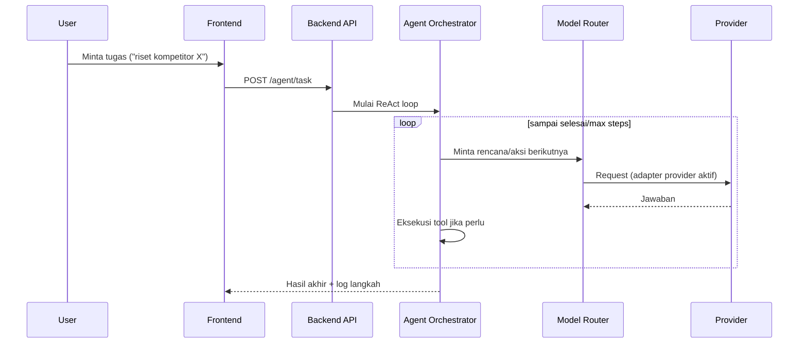
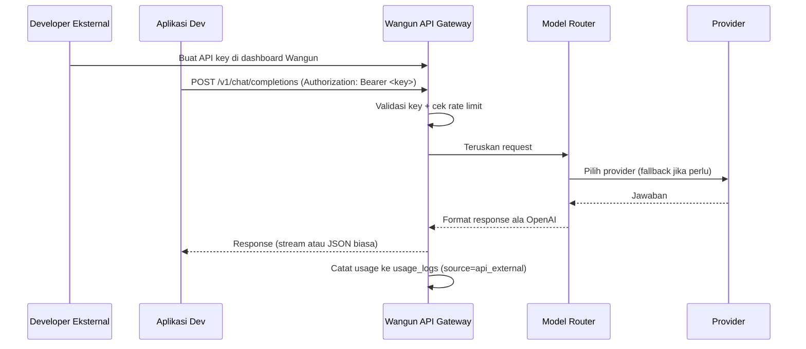
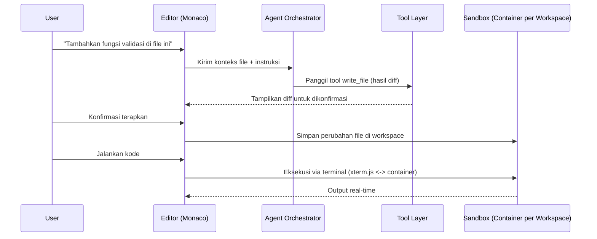
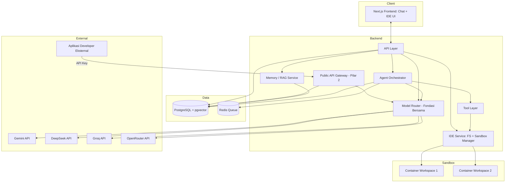
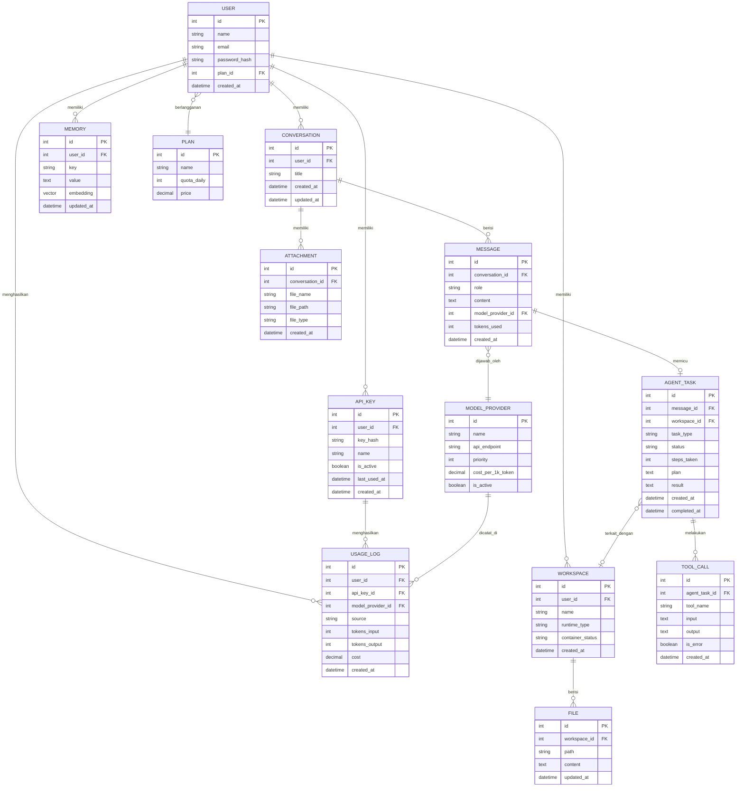

# Blueprint: Wangun — Agentic AI Chat, IDE, & Router Platform

Dokumen ini adalah gambaran teknis lengkap dan rinci Wangun — platform 3-in-1 (Chat Agentic + IDE + Router-as-a-Service) — dari alur pengguna, arsitektur sistem, logika Model Router & Agent Loop (dibangun dari nol), modul IDE, struktur database (ERD/LRS), sampai rekomendasi tech stack, API AI gratis, dan arahan desain.

---

## Daftar Isi

1. Visi & Tiga Pilar Produk
2. Prinsip Arsitektur (Dibangun dari Nol)
3. Alur Pengguna — per Pilar
4. Arsitektur Sistem (Diagram)
5. Modul/Fitur Utama
6. Pilar 1: Model Router (Inti Bersama)
7. Pilar 1: Agent Orchestrator (ReAct Loop)
8. Tool Layer
9. Memory & RAG
10. Pilar 2: Router-as-a-Service (Endpoint Publik)
11. Pilar 3: Modul IDE
12. ERD (Entity Relationship Diagram)
13. LRS (Logical Record Structure)
14. Struktur Folder Proyek
15. Rekomendasi API AI Gratis
16. Rekomendasi Tech Stack
17. Keamanan & Observability
18. Arahan Desain (Simpel & Elegan)
19. Tentang Antigravity sebagai Alat Bantu Development
20. Roadmap Implementasi Bertahap (v1/v2/v3)
21. Langkah Berikutnya

---

## 1. Visi & Tiga Pilar Produk

**Wangun** dibangun di atas satu fondasi (Model Router buatan sendiri, mengalihkan request ke API AI gratis seperti Gemini/DeepSeek) yang dipakai oleh tiga pilar produk:

| Pilar | Analogi | Fungsi |
|---|---|---|
| **1. Agentic AI Chat** | ChatGPT/Claude/Gemini | Percakapan + tugas multi-langkah otomatis |
| **2. Router-as-a-Service** | 9Router/OpenRouter | Endpoint API publik yang bisa dipakai developer lain sebagai gateway AI mereka |
| **3. IDE Terintegrasi** | VSCode/Antigravity/Cursor | Editor kode + terminal + agent yang bisa mengedit & menjalankan kode langsung |

Semua dibangun **dari nol** — setiap komponen inti ditulis sendiri (bukan fork proyek open-source) supaya dipahami sepenuhnya dan bebas disesuaikan.

⚠️ **Catatan skala**: ini gabungan 3 produk besar. Blueprint ini mendokumentasikan arsitektur penuh, tapi implementasi dibagi bertahap (Bagian 20): Pilar 1 dulu (v1), baru Pilar 2 (v2), baru Pilar 3 (v3) — karena Pilar 2 & 3 sebenarnya adalah **ekstensi** dari fondasi Pilar 1, bukan sistem terpisah dari nol lagi.

---

## 2. Prinsip Arsitektur (Dibangun dari Nol)

- **Adapter Pattern** untuk tiap provider AI — satu interface standar (`generate()`, `stream()`) dipenuhi oleh implementasi khusus tiap provider.
- **Router sebagai lapisan tipis** — hanya memilih adapter & menangani fallback, dipakai bersama oleh Pilar 1 (internal) dan Pilar 2 (endpoint publik) tanpa duplikasi logika.
- **Agent Loop sebagai state machine sederhana** — loop `while` dengan status jelas: `planning → acting → observing → done/failed`. Tool yang dipanggil bergantung konteks: tool riset untuk Pilar 1, tool `write_file`/`run_terminal` tambahan untuk Pilar 3.
- **Tool sebagai fungsi murni** — setiap tool menerima input terstruktur dan mengembalikan output terstruktur.
- **Semua konfigurasi provider & kuota disimpan di database**, bukan hardcode — termasuk kuota terpisah untuk traffic internal (Pilar 1) vs eksternal (Pilar 2).
- **Observability dari awal** — setiap panggilan provider, tool-call, dan request API eksternal dicatat sejak hari pertama.
- **Isolasi kuota antar pilar** — traffic dari chat internal tidak boleh menghabiskan kuota gratis yang dipakai developer eksternal, dan sebaliknya. Ini butuh pemisahan "sumber traffic" di level pencatatan (Bagian 12).

---

## 3. Alur Pengguna — per Pilar

### Pilar 1: Chat & Agentic (ringkas — detail lengkap di versi sebelumnya)



### Pilar 2: Developer Eksternal Memakai Router API (BARU)



Poin penting: dari sudut pandang developer eksternal, endpoint ini **terasa identik dengan memanggil OpenAI/OpenRouter/9Router** — cukup ganti `base_url` dan `api_key` di SDK yang sudah mereka pakai.

### Pilar 3: Coding dengan Bantuan Agent di IDE (BARU)



---

## 4. Arsitektur Sistem (Diagram)



**Alur singkat:** Model Router jadi satu-satunya jalur ke provider eksternal, dipakai baik oleh Agent Orchestrator (Pilar 1 & 3) maupun langsung oleh Public API Gateway (Pilar 2) — tidak ada duplikasi logika routing. IDE Service mengelola container sandbox per workspace, terpisah sepenuhnya dari server utama untuk keamanan.

---

## 5. Modul/Fitur Utama

| Modul | Pilar | Fungsi | Kompleksitas dari Nol |
|---|---|---|---|
| Auth & User Management | Semua | Login, profil, plan/kuota, API key | Rendah |
| Chat Engine | 1 | Percakapan real-time + streaming + memory | Rendah–Sedang |
| Model Router | Fondasi | Pilih & alihkan request ke provider, dengan fallback | Rendah |
| Agent Orchestrator | 1, 3 | Rencana → eksekusi → verifikasi multi-step | Sedang |
| Tool Layer | 1, 3 | Web search, code exec, file read/write, terminal | Rendah per tool |
| Memory & RAG | 1 | Long-term memory per user | Sedang |
| Public API Gateway | 2 | Endpoint kompatibel OpenAI, API key, rate limit | Sedang |
| Dokumentasi Developer | 2 | Halaman docs + contoh kode | Rendah |
| IDE Editor (Monaco) | 3 | Code editor dengan syntax highlighting | Sedang (integrasi library) |
| Terminal (xterm.js) | 3 | Terminal terhubung ke sandbox container | Sedang |
| Sandbox Manager | 3 | Provisioning & isolasi container per workspace | Tinggi |
| Admin/Observability | Semua | Log pemakaian, biaya, error per pilar | Rendah |

---

## 6. Pilar 1: Model Router (Inti Bersama)

### Interface adapter standar

```ts
interface ModelProviderAdapter {
  name: string;
  generate(params: { messages: ChatMessage[]; maxTokens?: number }): Promise<{ content: string; tokensUsed: number }>;
  stream(params: { messages: ChatMessage[] }): AsyncGenerator<string>;
}
```

### Logika Router (fallback), dipakai bersama Pilar 1 & 2

```ts
async function routeRequest(
  messages: ChatMessage[],
  opts: { complexity: "ringan" | "berat"; source: "internal_chat" | "api_external"; sourceId: string }
) {
  const providers = await getActiveProvidersSortedByPriority(opts.complexity);
  for (const provider of providers) {
    try {
      const result = await provider.generate({ messages });
      await logUsage(provider.name, result.tokensUsed, opts.source, opts.sourceId);
      return result;
    } catch (err) {
      if (isRateLimitOrQuotaError(err)) continue;
      throw err;
    }
  }
  throw new Error("Semua provider gagal/kuota habis");
}
```

Perhatikan parameter `source` dan `sourceId` — ini kunci supaya kuota traffic internal (chat) dan eksternal (API key developer) tercatat & bisa dibatasi terpisah (lihat Bagian 10 & 17).

### Aturan pemilihan provider

| Kondisi | Provider diutamakan |
|---|---|
| Task ringan | Gemini Flash → Groq |
| Task reasoning/coding kompleks | DeepSeek-V3/R1 → Gemini Flash |
| Semua kuota utama habis | OpenRouter → Mistral |

---

## 7. Pilar 1: Agent Orchestrator (ReAct Loop)

### Format Action terstruktur

```json
{ "thought": "Saya perlu mencari data terbaru tentang X", "action": "web_search", "action_input": { "query": "..." } }
```

Atau untuk tugas selesai:

```json
{ "thought": "Saya sudah punya cukup informasi", "action": "final_answer", "action_input": { "answer": "..." } }
```

### System prompt planner (diperluas untuk mendukung tool IDE di Pilar 3)

```
Kamu adalah agent yang menyelesaikan tugas secara bertahap.
Balas HANYA dalam format JSON: { "thought": "...", "action": "<nama_tool>", "action_input": {...} }

Tool yang tersedia (tergantung konteks — chat biasa atau sesi IDE):
- web_search(query): mencari informasi di internet
- run_code(code): menjalankan kode di sandbox umum
- read_file(file_id): membaca isi file yang diupload user
- write_file(path, content): menulis/mengubah file di workspace IDE (hanya tersedia dalam sesi IDE)
- run_terminal(command): menjalankan perintah terminal di sandbox workspace (hanya tersedia dalam sesi IDE, butuh konfirmasi user untuk perintah berisiko)
- save_memory(key, value): menyimpan fakta penting untuk diingat lintas sesi
- final_answer(answer): tugas selesai

Batasi dirimu maksimal {max_steps} langkah sebelum memberi jawaban akhir.
```

### Pseudocode loop utama

```ts
async function runAgentLoop(taskId: string, initialMessage: string, ctx: { mode: "chat" | "ide"; workspaceId?: string }) {
  let steps = 0;
  const maxSteps = 10;
  let context = buildInitialContext(initialMessage, ctx);
  await updateTaskStatus(taskId, "planning");

  while (steps < maxSteps) {
    const modelOutput = await routeRequest(context, { complexity: "berat", source: "internal_chat", sourceId: taskId });
    const action = parseJsonAction(modelOutput.content);

    if (action.action === "final_answer") {
      await updateTaskStatus(taskId, "done", action.action_input.answer);
      return action.action_input.answer;
    }

    if (needsUserConfirmation(action)) {
      await updateTaskStatus(taskId, "awaiting_confirmation");
      const confirmed = await waitForUserConfirmation(taskId);
      if (!confirmed) { await updateTaskStatus(taskId, "failed", "Dibatalkan user"); return; }
    }

    await updateTaskStatus(taskId, "acting");
    const toolResult = await callTool(action.action, action.action_input, ctx);
    await logToolCall(taskId, action.action, action.action_input, toolResult);
    context = appendObservation(context, toolResult);
    await updateTaskStatus(taskId, "observing");
    steps++;
  }
  await updateTaskStatus(taskId, "failed", "Melebihi batas langkah maksimum");
}
```

Fungsi `needsUserConfirmation` baru ditambahkan supaya perintah berisiko (misal `run_terminal` dengan `rm`, atau `write_file` yang menimpa banyak baris) selalu minta persetujuan eksplisit — penting begitu agent bisa mengubah kode sungguhan di Pilar 3.

---

## 8. Tool Layer

| Tool | Pilar | Input | Output | Catatan |
|---|---|---|---|---|
| `web_search` | 1, 3 | `{ query }` | Daftar hasil | API search gratis/scraping ringan |
| `run_code` | 1 | `{ code, language }` | `{ stdout, stderr }` | Sandbox umum, tanpa akses ke workspace IDE |
| `read_file` | 1, 3 | `{ file_id }` atau `{ path }` | Isi file | Untuk upload biasa atau file dalam workspace |
| `fetch_url` | 1 | `{ url }` | Konten halaman | Untuk agent baca 1 halaman hasil `web_search` |
| `save_memory` | 1 | `{ key, value }` | Konfirmasi | Menulis ke `memories` + embedding |
| `write_file` (baru) | 3 | `{ workspace_id, path, content, mode: "diff"\|"overwrite" }` | Diff atau konfirmasi tersimpan | Selalu tampilkan diff dulu kecuali auto-apply diaktifkan |
| `run_terminal` (baru) | 3 | `{ workspace_id, command }` | `{ stdout, stderr, exit_code }` | Wajib lewat Sandbox Manager, command berisiko butuh konfirmasi |

Registry tool tetap satu `Record<string, ToolFunction>`, tapi tool yang tersedia difilter sesuai `ctx.mode` (chat vs ide) saat system prompt disusun.

---

## 9. Memory & RAG

Tidak berubah dari desain sebelumnya:
1. Fakta penting diringkas → diubah jadi embedding (API embedding gratis, misal dari Gemini) → disimpan di `memories`
2. Saat chat baru, pesan user diubah jadi embedding, dicari kemiripan lewat pgvector (`ORDER BY embedding <-> query_embedding LIMIT 5`)
3. Hasilnya disisipkan sebagai konteks tambahan di system prompt

---

## 10. Pilar 2: Router-as-a-Service (Endpoint Publik)

### Endpoint utama

```
POST /v1/chat/completions
Authorization: Bearer <api_key>
Content-Type: application/json

{
  "model": "wangun-auto",         // atau nama spesifik: "gemini-flash", "deepseek-v3"
  "messages": [{ "role": "user", "content": "..." }],
  "stream": true
}
```

Response mengikuti format standar OpenAI (`choices[0].message.content`, atau chunk SSE kalau `stream: true`) — supaya developer eksternal tinggal ganti `base_url` di SDK OpenAI resmi mereka, tanpa ubah kode lain.

### Alur validasi request

```ts
async function handlePublicApiRequest(req: Request) {
  const apiKey = extractBearerToken(req);
  const keyRecord = await validateApiKey(apiKey); // cek hash cocok & is_active
  if (!keyRecord) return response401();

  const withinQuota = await checkRateLimit(keyRecord.id); // cek terhadap plans.quota_daily milik key ini
  if (!withinQuota) return response429();

  const result = await routeRequest(req.body.messages, {
    complexity: inferComplexity(req.body.messages),
    source: "api_external",
    sourceId: keyRecord.id,
  });
  await touchApiKeyLastUsed(keyRecord.id);
  return formatAsOpenAiResponse(result);
}
```

### Manajemen API Key (sisi user)

- Dashboard sederhana: tombol "Generate API Key", key ditampilkan **hanya sekali** saat dibuat (best practice standar — hanya hash yang disimpan di database)
- Daftar key aktif dengan info `last_used_at`, tombol "Cabut" per key
- Halaman dokumentasi statis dengan contoh `curl` dan contoh kode Node.js/Python

### Isolasi kuota internal vs eksternal

Kolom `source` di `usage_logs` (`internal_chat` vs `api_external`) memungkinkan dua kuota dihitung terpisah terhadap batas harian tiap provider gratis — supaya trafik chat internal Wangun tidak tiba-tiba habis karena banyak developer eksternal memakai API key, atau sebaliknya.

---

## 11. Pilar 3: Modul IDE

### Komponen inti

| Komponen | Library/Pendekatan | Fungsi |
|---|---|---|
| Code Editor | **Monaco Editor** (mesin yang sama dipakai VSCode) | Syntax highlighting, multi-tab, integrasi mudah dengan React/Next.js |
| Terminal | **xterm.js** | Render terminal di browser, terhubung via WebSocket ke proses di container |
| Virtual File System | Disimpan di `files` (database) untuk persistensi + disinkronkan ke volume container saat workspace aktif | Sumber kebenaran file ada di database, container cuma "runtime" |
| Sandbox Manager | **Layanan sandbox terkelola (E2B atau sejenis)** — bukan Docker, karena tidak ada Docker di lingkungan development | Isolasi penuh — tidak ada akses ke sistem lain atau workspace user lain |

### Alur kerja workspace

1. User buka/buat `workspace` → sistem provisioning container baru (image dasar sesuai bahasa, misal Node.js atau Python)
2. File dari database di-mount/disinkronkan ke container
3. User edit file lewat Monaco → perubahan disimpan ke database (auto-save berkala) dan ke container
4. User jalankan perintah lewat terminal → dieksekusi di dalam container, output di-stream balik lewat WebSocket
5. Agent bisa memanggil `write_file`/`run_terminal` dengan alur yang sama, tapi selalu lewat tahap konfirmasi diff (kecuali mode auto-apply)
6. Container dimatikan otomatis setelah periode idle (misal 15 menit) untuk hemat resource — file tetap aman di database

### Kenapa ini paling kompleks di antara 3 pilar

Sandbox Manager butuh: provisioning container on-demand, batas resource (CPU/memory/waktu eksekusi), jaringan yang dibatasi (default tanpa akses keluar kecuali diizinkan), dan mekanisme cleanup otomatis. Ini alasan Pilar 3 diletakkan di fase terakhir (v3) — butuh fondasi Pilar 1 & 2 sudah stabil dulu.

---

## 12. ERD (Entity Relationship Diagram)



**Penjelasan penambahan dari versi sebelumnya:**
- `API_KEY` (baru) — untuk Pilar 2, menyimpan hash key, status aktif, dan kapan terakhir dipakai
- `WORKSPACE` & `FILE` (baru) — untuk Pilar 3, `WORKSPACE` merepresentasikan 1 sesi IDE/container, `FILE` menyimpan seluruh isi kode sebagai sumber kebenaran
- `USAGE_LOG` mendapat kolom `source` (internal_chat/api_external) dan `api_key_id` (nullable — hanya terisi kalau sumbernya dari Pilar 2) — inilah mekanisme isolasi kuota yang dibahas di Bagian 10
- `AGENT_TASK` mendapat `workspace_id` (nullable) — terisi kalau agent task itu berjalan dalam konteks IDE

---

## 13. LRS (Logical Record Structure)

**users**
| Field | Tipe | Ket |
|---|---|---|
| id | INT | PK |
| name | VARCHAR | |
| email | VARCHAR | UNIQUE |
| password_hash | VARCHAR | |
| plan_id | INT | FK → plans.id |
| created_at | DATETIME | |

**plans**
| Field | Tipe | Ket |
|---|---|---|
| id | INT | PK |
| name | VARCHAR | |
| quota_daily | INT | |
| price | DECIMAL | |

**conversations**
| Field | Tipe | Ket |
|---|---|---|
| id | INT | PK |
| user_id | INT | FK → users.id |
| title | VARCHAR | |
| created_at | DATETIME | |
| updated_at | DATETIME | |

**messages**
| Field | Tipe | Ket |
|---|---|---|
| id | INT | PK |
| conversation_id | INT | FK → conversations.id |
| role | VARCHAR | user/assistant/system |
| content | TEXT | |
| model_provider_id | INT | FK → model_providers.id |
| tokens_used | INT | |
| created_at | DATETIME | |

**attachments**
| Field | Tipe | Ket |
|---|---|---|
| id | INT | PK |
| conversation_id | INT | FK → conversations.id |
| file_name | VARCHAR | |
| file_path | VARCHAR | |
| file_type | VARCHAR | |
| created_at | DATETIME | |

**agent_tasks**
| Field | Tipe | Ket |
|---|---|---|
| id | INT | PK |
| message_id | INT | FK → messages.id |
| workspace_id | INT | FK → workspaces.id, NULLABLE |
| task_type | VARCHAR | |
| status | VARCHAR | pending/planning/acting/observing/awaiting_confirmation/done/failed |
| steps_taken | INT | |
| plan | TEXT | |
| result | TEXT | |
| created_at | DATETIME | |
| completed_at | DATETIME | |

**tool_calls**
| Field | Tipe | Ket |
|---|---|---|
| id | INT | PK |
| agent_task_id | INT | FK → agent_tasks.id |
| tool_name | VARCHAR | |
| input | TEXT | |
| output | TEXT | |
| is_error | BOOLEAN | |
| created_at | DATETIME | |

**model_providers**
| Field | Tipe | Ket |
|---|---|---|
| id | INT | PK |
| name | VARCHAR | Gemini, DeepSeek, dst |
| api_endpoint | VARCHAR | |
| priority | INT | |
| cost_per_1k_token | DECIMAL | 0 untuk yang gratis |
| is_active | BOOLEAN | |

**memories**
| Field | Tipe | Ket |
|---|---|---|
| id | INT | PK |
| user_id | INT | FK → users.id |
| key | VARCHAR | |
| value | TEXT | |
| embedding | VECTOR | |
| updated_at | DATETIME | |

**usage_logs**
| Field | Tipe | Ket |
|---|---|---|
| id | INT | PK |
| user_id | INT | FK → users.id |
| api_key_id | INT | FK → api_keys.id, NULLABLE |
| model_provider_id | INT | FK → model_providers.id |
| source | VARCHAR | internal_chat / api_external |
| tokens_input | INT | |
| tokens_output | INT | |
| cost | DECIMAL | |
| created_at | DATETIME | |

**api_keys** (baru)
| Field | Tipe | Ket |
|---|---|---|
| id | INT | PK |
| user_id | INT | FK → users.id |
| key_hash | VARCHAR | hash, bukan plain text |
| name | VARCHAR | label dari user, mis. "Proyek BURSAI" |
| is_active | BOOLEAN | |
| last_used_at | DATETIME | |
| created_at | DATETIME | |

**workspaces** (baru)
| Field | Tipe | Ket |
|---|---|---|
| id | INT | PK |
| user_id | INT | FK → users.id |
| name | VARCHAR | |
| runtime_type | VARCHAR | node/python/dst |
| container_status | VARCHAR | stopped/starting/running |
| created_at | DATETIME | |

**files** (baru)
| Field | Tipe | Ket |
|---|---|---|
| id | INT | PK |
| workspace_id | INT | FK → workspaces.id |
| path | VARCHAR | |
| content | TEXT | |
| updated_at | DATETIME | |

---

## 14. Struktur Folder Proyek

⚠️ Struktur di bawah ini dibuat **langsung di dalam folder project Wangun yang sudah dibuka** (root project) — bukan di dalam subfolder/folder pembungkus baru. Alat bantu (misal Antigravity, atau perintah scaffolding seperti `create-next-app`) harus dijalankan supaya hasilnya jatuh langsung di root yang sudah ada, bukan membuat folder project baru lagi di dalamnya.

```
/src
  /app
    /api/chat/route.ts
    /api/agent/route.ts
    /api/v1/chat/completions/route.ts   // Pilar 2: endpoint publik
    /api/workspaces/[id]/route.ts       // Pilar 3
    /(ide)/editor                       // Halaman IDE
    /(chat)                             // Halaman chat
  /providers
    gemini.ts
    deepseek.ts
    groq.ts
    openrouter.ts
  /router
    index.ts
    rules.ts
  /agent
    loop.ts
    prompts.ts
    parseAction.ts
  /tools
    registry.ts
    webSearch.ts
    runCode.ts
    readFile.ts
    fetchUrl.ts
    saveMemory.ts
    writeFile.ts        // Pilar 3
    runTerminal.ts       // Pilar 3
  /gateway               // Pilar 2
    auth.ts              // validasi API key
    rateLimit.ts
    formatOpenAi.ts
  /ide                   // Pilar 3
    sandboxManager.ts    // provisioning & lifecycle container
    fileSync.ts          // sinkronisasi DB <-> container
    terminalSocket.ts    // WebSocket handler untuk xterm.js
  /memory
    embed.ts
    store.ts
  /db
    schema.sql
    client.ts
  /components
    /chat
    /ide
  /lib
    auth.ts
    usageLogger.ts
```

---

## 15. Rekomendasi API AI Gratis (per pertengahan 2026)

| Provider | Model gratis | Batas | Catatan |
|---|---|---|---|
| **Google Gemini** | Gemini Flash | ±1.500 request/hari, 60 rpm | Stabil, multimodal, tanpa kartu kredit |
| **DeepSeek** | DeepSeek-V3 / R1 | ±500.000 token/hari | Reasoning & coding kuat |
| **Groq** | Llama/gpt-oss via Groq | ±30 request/menit | Kecepatan inferensi tinggi |
| **OpenRouter** | Belasan model gratis | ±50 request/hari per model | Fallback tambahan |
| **Mistral AI** | Mistral Small/Medium (free mode) | Tergantung kebijakan saat ini | Alternatif task ringan |
| **Cloudflare Workers AI** | Beberapa model open-source | ±10.000 neuron/hari | Task ringan/embedding |

⚠️ Kuota/kebijakan gratis bisa berubah — router harus didesain gampang tambah/kurangi provider tanpa ubah banyak kode (sudah terpenuhi lewat tabel `model_providers`).

---

## 16. Rekomendasi Tech Stack

| Layer | Rekomendasi | Alasan |
|---|---|---|
| Frontend | **Next.js** (App Router) + Tailwind CSS | Satu framework untuk halaman Chat & IDE |
| Chat streaming | **Vercel AI SDK** (primitif UI saja) | Tetap "dari nol" di logika bisnis |
| Backend/Orchestrator | **Node.js + TypeScript**, loop custom (Bagian 7) | Kontrol penuh, tanpa framework agent pihak ketiga |
| Model Router | Ditulis sendiri (Bagian 6) | ~100–200 baris kode inti |
| Public API Gateway | Route handler Next.js + middleware auth/rate-limit sendiri | Konsisten dengan prinsip "dari nol" |
| Database utama | **PostgreSQL** | Free tier di Supabase/Neon |
| Vector DB | **pgvector** | Satu infra dengan Postgres |
| Queue/task async | **Redis + BullMQ** | Agent task & provisioning container |
| Sandbox eksekusi kode (Pilar 1) | **Layanan sandbox terkelola (E2B atau sejenis)** — bukan Docker, karena tidak ada Docker terpasang di lingkungan development | Untuk `run_code` biasa |
| **Code Editor (Pilar 3)** | **Monaco Editor** | Mesin sama dengan VSCode, gratis, open-source |
| **Terminal (Pilar 3)** | **xterm.js** + WebSocket | Terminal browser standar industri |
| **Sandbox per workspace (Pilar 3)** | **Layanan sandbox terkelola (E2B atau sejenis)** — bukan Docker container sendiri, karena lingkungan development tidak punya Docker | Isolasi kuat, lifecycle idle-timeout, tanpa perlu ops Docker sama sekali |
| Hosting | **Vercel** (frontend) + **Railway/Fly.io** (backend, router, sandbox manager) | Free tier untuk MVP |
| Auth | **Auth.js (NextAuth)** atau **Supabase Auth** | Cepat setup |

---

## 17. Keamanan & Observability

- **Sandbox eksekusi kode**: baik `run_code` (Pilar 1) maupun workspace IDE (Pilar 3) wajib container terpisah, network dibatasi, CPU/memory/waktu eksekusi dibatasi.
- **Keamanan API Key (Pilar 2)**: key hanya ditampilkan sekali saat dibuat, disimpan sebagai hash; validasi request harus reject cepat kalau key tidak valid/nonaktif; log percobaan key invalid untuk deteksi abuse.
- **Rate limiting berlapis**: per user (chat internal, dari `plans`) DAN per API key (Pilar 2, bisa beda kuota) — keduanya independen supaya tidak saling memengaruhi.
- **Validasi input tool**: terutama `write_file`/`run_terminal` di Pilar 3 — validasi path (cegah keluar dari workspace, mis. `../../etc/passwd`), dan command berbahaya wajib lewat konfirmasi user.
- **Logging lengkap & tersegmentasi**: `usage_logs` dengan kolom `source` memungkinkan dashboard terpisah untuk "pemakaian chat internal" vs "pemakaian developer eksternal" vs "pemakaian IDE".
- **Batas keras jumlah langkah agent** (`maxSteps`) — berlaku di semua pilar yang memakai Agent Orchestrator.
- **Isolasi container antar workspace** — satu workspace tidak boleh bisa mengakses filesystem/proses workspace user lain, bahkan kalau berjalan di server fisik yang sama.

---

## 18. Arahan Desain (Simpel & Elegan)

- **Warna netral**: palet monokrom/abu-abu dengan 1 warna aksen, hindari gradient
- **Tipografi**: 1 font sans-serif bersih (Inter/Geist/IBM Plex Sans) untuk UI, 1 font monospace untuk area kode (mis. JetBrains Mono/Fira Code)
- **Layout Chat**: sidebar tipis + chat bubble minimalis, progress agent sebagai list yang bisa di-expand/collapse
- **Layout IDE**: tiga panel (file explorer kiri, editor+terminal tengah, panel AI/agent kanan) — konsisten palet warna dengan halaman Chat supaya terasa satu produk, bukan dua aplikasi berbeda
- **Dark mode default** — umum disukai untuk tool AI maupun IDE, dan mengurangi silau saat coding lama
- **Konsistensi lintas pilar**: komponen UI (tombol, badge model provider, kartu diff) dipakai ulang di Chat maupun IDE, supaya berpindah antar mode terasa mulus

---

## 19. Tentang Antigravity sebagai Alat Bantu Development

Antigravity (Google) adalah IDE agent-first berbasis Gemini — dipakai untuk *membangun* Wangun, bukan bagian dari produk jadi. Struktur folder (Bagian 14) dan pseudocode di Bagian 6, 7, 10, 11 bisa langsung jadi acuan prompt saat delegasi coding ke Antigravity.

---

## 20. Roadmap Implementasi Bertahap (v1/v2/v3)

**v1 — Fondasi Chat & Agent (≈9 minggu, lihat rincian minggu-per-minggu di draf sebelumnya)**
- Auth, database inti, 2 provider + router, chat streaming, agent v1 (web_search), memory dasar

**v2 — Router-as-a-Service (+4–6 minggu setelah v1 stabil)**
- Minggu 1: tabel `api_keys`, halaman generate/cabut key
- Minggu 2: endpoint `/v1/chat/completions` + format response ala OpenAI
- Minggu 3: rate limiting per key + isolasi kuota (`usage_logs.source`)
- Minggu 4–5: dokumentasi developer + contoh kode
- Minggu 6: uji integrasi nyata (idealnya dari proyek lain milik sendiri, mis. dipanggil dari [[bursai]] atau [[lapak-chicken-seturan]] sebagai klien pertama)

**v3 — Modul IDE (+6–8 minggu setelah v2)**
- Minggu 1–2: tabel `workspaces`/`files`, integrasi Monaco Editor dasar (tanpa eksekusi)
- Minggu 3–4: Sandbox Manager (provisioning container) + xterm.js terhubung ke container
- Minggu 5–6: tool `write_file`/`run_terminal` di Agent Orchestrator + alur konfirmasi diff
- Minggu 7–8: penghalusan keamanan (isolasi, idle-timeout container), uji end-to-end

---

## 21. Langkah Berikutnya

1. Fokuskan dulu ke v1 sampai tabel `users`, `conversations`, `messages` jalan dengan router 2 provider
2. Setelah chat+agent v1 dipakai nyata, baru buka `api_keys` & endpoint publik (v2) — jangan mulai v2/v3 sebelum v1 stabil
3. Siapkan `schema.sql` final mencakup seluruh tabel di Bagian 13 (bisa dibuat sekarang meski implementasi bertahap, supaya migrasi lebih mudah nanti)
4. Rancang detail keamanan Sandbox Manager (Bagian 17) sebelum mulai v3 — ini bagian paling berisiko kalau tergesa-gesa
